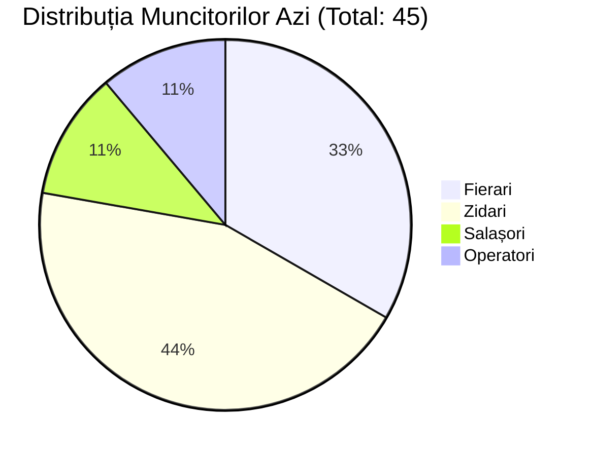

# 🏗️ Pontaj Digital: Revoluția pe Șantier

> [!NOTE]
> **O aplicație completă, creată pentru oamenii de pe teren, dar gândită pentru cei din birouri.** 
> De la muncitorul necalificat care apasă un singur buton, până la directorul care vede rapoartele de la distanță. Fără foi, fără erori.

## 👥 Cele 4 Nivele ale Ecosistemului

Aplicația se adaptează automat în funcție de cine se loghează, oferind exact uneltele potrivite.

````carousel

<!-- slide -->

<!-- slide -->

<!-- slide -->

````

---

### 1️⃣ Interfața Muncitor
**Scop:** Zero bariere tehnice. Pontaj cu un singur tap.

> [!TIP]
> Aplicația știe deja pe ce șantier se află muncitorul datorită modulului **Geofence GPS**. Dacă s-a îndepărtat cu 300m de șantier, pontajul intră automat în pauză!

**Exemplu Mock UI:**
```diff
+ 📍 Locație: Șantier Rezidențial Nord (Confirmat)
+ ⏱️ Ora curentă: 07:30 AM
  
  [Buton IMENS Verde: LUCREAZĂ (CLOCK IN)]
  [Pauză Masă]
```
- **Fără tastare**: Butoane extrem de mari, design "dark mode" ca să poată fi citit oricât de puternic curge soarele.
- **Transparență totală**: Muncitorul vede clar câte ore are pe luna în curs—elimină frustrarea de la finalul lunii: *"șefu', unde mi-s orele?"*

---

### 2️⃣ Șeful de Echipă
**Scop:** Responsabilitate pe grup, pontaj colectiv rapid.

> [!IMPORTANT]
> Un șef de echipă își cunoaște oamenii. În loc ca toți cei 10 salahori să se chinuie să se ponteze de pe 10 telefoane, Șeful dă un singur click.

| Nume Muncitor | Status Echipă | Rol | Acțiuni Rapide (Mock) |
|---|---|---|---|
| Ionescu Vasile | 🟢 Activ (07:30) | Fierar | `[Pune în Pauză]` |
| Popescu Ion   | 🔴 Absent | Zidar | `[Pontează Manual]` |
| Diaconu Mihai | 🟡 Pauză | Salahor | `[Reia Lucrul]` |

- **Funcție magică "Pontaj Colectiv"**: Bifează toți oamenii din echipă și apasă *Clock In Pentru Toți*. Într-o secundă, 10 inși au început programul.
- **Activitate Detaliată**: După ce pleacă, poate introduce cantitatea exactă: *Azi echipa a montat 500 mp Armătură*. 

---

### 3️⃣ Șeful de Șantier (Dirigintele)
**Scop:** Controlul haosului de la fața locului.



- **Lista LIVE**: O privire pe tabletă și știe dacă are 45 de inși în teren sau dacă jertfa de 20 de zidari care a promis că vine... lipsește.
- **Validarea Pontajului**: A doua zi, șeful de șantier găsește în cont fișele "Pending". O aprobare înseamnă o semnătură digitală, care blochează modificările ulterioare. Totul extrem de organizat. 
- **Siguranță Geofence**: Știe automat dacă *"Gheorghe e la magazin după bere"*, pentru că harta l-a făcut Roșu.

---

### 4️⃣ Portalul Adminului / Directorului
**Scop:** Cifre reale, financiare, optimizare.

> [!WARNING]
> Fără un software ca acesta, 15% din orele plătite pe un șantier sunt "ore moarte" neverificabile.

**Board-ul Zilei (Desktop UI):**
- **Dashboard Speed:** Grafice inteligente și rapide. *Muncitori Activi, Evidența pe Șantiere, Ore Pierdute*.
- **Harta GPS (Live)**: Toate șantierele firmei afișate simultan, cu pini colorați care indică câți oameni sunt logați *ACUM*.
- **Rapoarte de Contabilitate**: Un simplu "Export Excel", care se conectează direct la sistemul de salarizare de la capăt de lună.

---

### 🔥 De ce "Pontaj Digital" e o revoluție?
1. **Operează 100% în Cloud (Supabase/Render)** - Datele sunt în siguranță, backend super-rapid.
2. **Elimină Frauda de Timp** - Nu mai există *"trece-mă că am stat 10 ore"*. Poza GPS confirmă dacă e acolo; dacă fuge din perimetrul șantierului, ceasul îngheață.
3. **Pace of mind pentru HR** - Condicile dispar, se printează rapoarte cu precizie la minut, iar angajații au mai multă încredere în firmă știind că totul se joacă pe bune.
